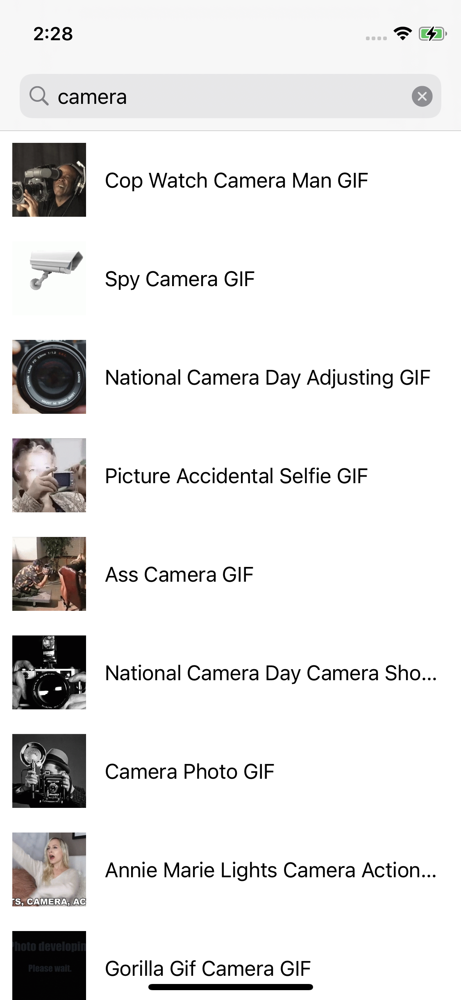

# iOS Take Home

Goal: Create an iOS app with two views, `MainViewController` and `DetailViewController`. The `MainViewController` contains a list of GIFs from the [Giphy API](https://developers.giphy.com/). Clone or download this repo to start, and please do not use SwiftUI or Storyboard.

When there is no query, the view should display the featured (trending) gifs. When there is a query, it should display the search results from the API.

Tapping on a cell should push the `DetailViewController`. When the `DetailViewController` loads, it should request information from the API like title, source tld, and rating, and display it. This data must be requested from `DetailViewController`, not passed from the previous view controller (only pass the gif ID, then request data from the API again).

In summary, you will need to use three endpoints from the Giphy API: 1) trending, 2) search, and 3) get GIF by ID. (More info: https://developers.giphy.com/docs/api/endpoint) Also, when fetching trending gifs, please make sure to use the 'pg' rating as a request parameter.

You shouldn't need to use any additional dependencies.

And while not required, feel free to use your preferred architectural/design patterns or libraries/frameworks, and add additional flourishes or features! (e.g., using modern UIKit APIs, anything you'd like to improve)

## Setup

Get an API key [here](https://developers.giphy.com/dashboard/) and put it into `Constants.swift`

## Evaluation

### What you will be evaluated on

- Functionality (whether the app works as expected)
- Following modern best practices
- Use of architectural/design patterns
- Use of SnapKit for laying out views

### Bonus points

- Testability of code
- Appropirate access controls

### What you will not be evaluated on

- Testing (e.g., unit tests)
- Error handling
- Aesthetics

## Submission Instructions

Create a public GitHub repository. Share this GitHub URL with your point of contact.

## Screenshots

Note: The data displayed here is for demonstration purposes. You should display any data possible from the Giphy API that you can on the detail view.
